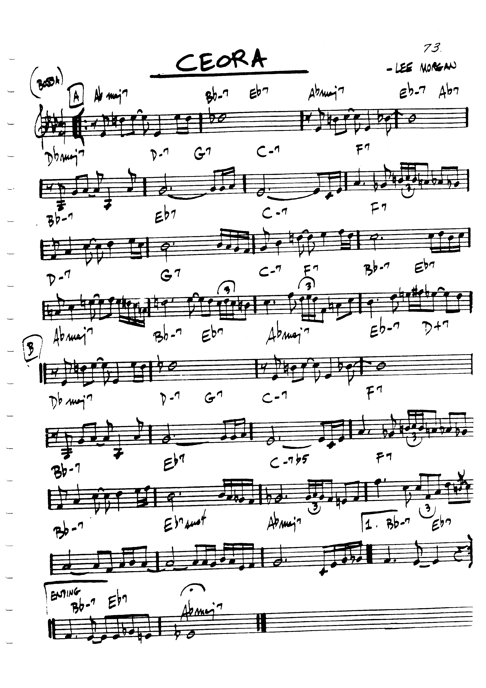
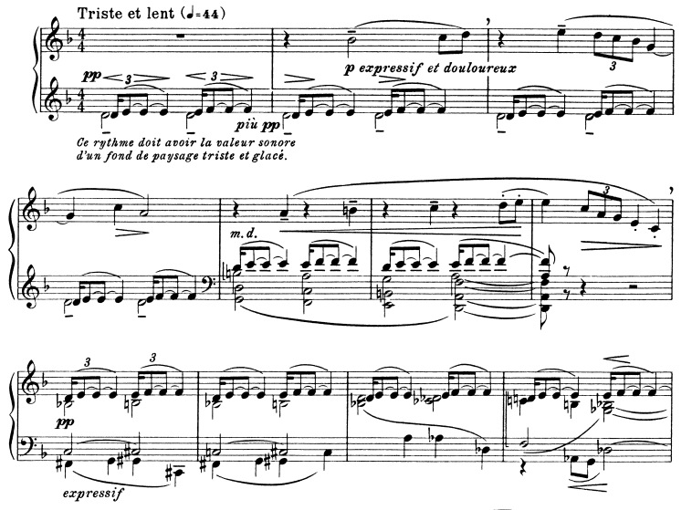
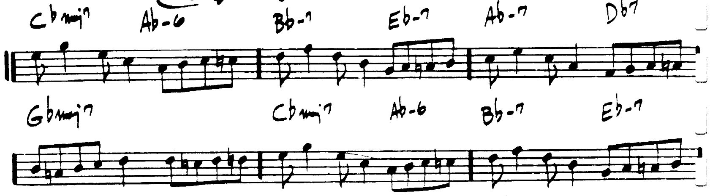
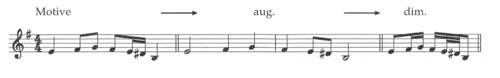
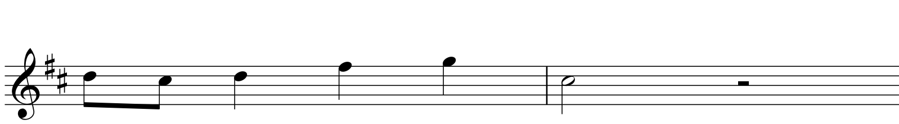
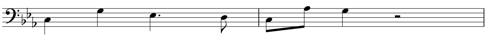

Motives
==========

"Ceora" by Lee Morgan
-----------------------

             

In "Ceora", Lee Morgan does an amazing job of creating both cohesion 
and diversity. This song is through composed (quite rare for a jazz piece), yet nevertheless
holds together quite well. 

Today it might be good for us to get into the specifics about what makes a motive what it is, 
what makes it work, and how it helps pieces.

Introduction
-------------

In music, we are always trying to walk a this tightrope of providing a 
continuously evolving experience, and creating a sense of cohesion.

Too many ideas can lead to sensory overload. Too few ideas with too much repetition can
be monotonous. In this class we will be looking at a number of ways in which a composer
can create interest in a piece, while nevertheless generating some sort of cohesion and unity.

The best way to do this is with motives. 

Motives can take place within any musical parameter.

- Harmonic motives
- Rhythmic motives
- Motivic usage of timbre
- Melodic Motives

Today we'll talk about the final example: Melodic Motives.

Characteristics of a Motive
-------------------------------

In an appendix to *The Complete Musician* Laitz lists a number of 
characteristics a motive should have.

- *Motives need to be audible.*

  It should be prominent enough that the listener is able to recognize it when it returns.

- *Motives need to be short.*

  Listeners are only able to retain a few seconds worth of material in their short-term memory. 
  It's best to keep motives concise.

- *Motives should consist of characteristic pitch contours or rhythms.* 
  
  The motive is going to undergo transformation's throughout the piece, so it 
  should be able to be transformed without losing it's identity. 

- *The original placement of the motive is important.*

  The motive should be placed in a prominent position, preferably toward the beginning of the piece.
  Pretty much every piece will contain multiple motives.

Types of Motives
----------------------

There are two types of motives that we can discuss:

- Motives that are a part of a larger theme.
- Motives that are generally independent ideas.

An excellent example of a motive that fits within a larger theme can be found in Beethoven's
"Pastoral" Symphony. (See handout)

The main theme of the movement (actually the main tune of the entire symphony)
can be seen in Example A. 

The theme can be divided even further into three motives. While each of these motives are 
unique, they contain a number of similar qualities. The X Motive rises by a fourth, 
and one of the more salient aspects of Y is the descent by a fourth in the first half of the measure. 

"Figures"
------------------

          

The example from *The Well-Tempered Clavier* (in the handout), is probably not a motive. Why not?

- It doesn't really undergo any sort of transformation. The pitch and rhythm both
  stay the same, and it holds its place as a texture in the background.

*Question:* How about the D-E,E-F motive in Debussy's "Des pas sur la neige"? Might we think of this as a motive?

	  Debussy's "Des pas sur la neige", from the first book of *Preludes*

 
This brings us to our first type of motivic repetition: strict motivic repetition 
(specifically through the use of reharmonization).

Reharmonization
~~~~~~~~~~~~~~~~~~~~~~~~~~

Using reharmonization allows for the use of strict repetition. The motive remains unchanged, but its context is changing.
See the above excerpt from "Des pas sur la neige."

Motivic Repetition		
------------------------

There are three main types of motivic repetition:

- Strict Motivic Repetition
- Modified Motivic Repetition
- Developmental Repetitions

Strict Repetition
----------------------

Strict repetition introduces stasis, so can really only exist briefly (unless repetition is intended 
for effect). It occurs when
the composer is introducing the theme to the listener, but is usually followed by 
some sort of modified or developmental repetition.

Imitation
~~~~~~~~~~~~~~~~~~~~~~~~~~

Imitation allows for the use of strict repetition. 

In order to do use imitation, one should try to use distinct registers. 

Modified Repetition
----------------------

Modified repetition (an extremely vague term) can fall into many categories.

- Embellishment
- Transposition (tonal or real)
- Sequence
- Diminution
- Augmentation
- Inversion
- Retrograde
- Retrograde Inversion

Embellishment
~~~~~~~~~~~~~~~~~~~~~~

Embellishment is quite self-explanatory. It is simply the adding of pitches to a motive. 
Grieg's "Erotikon" from his *Lyric Pieces* (in the handout) is an obvious example of this, using grace notes.

          

Transposition (tonal or real)
~~~~~~~~~~~~~~~~~~~~~~~~~~~~~~~~~

- Tonal transposition maintains the generic size of the intervals, but alters the quality so that they remain in the key.
- Real transposition maintains the specific interval size between each note in the motive (minor 3rds remain minor thirds, *etc.*).

Beethoven uses a real transposition of the theme in "Eroica."

The "hero" theme in the bass clef is transposed (by real transposition) in the bottom example in the handout.

Sequence
~~~~~~~~~~~~

This might be defined as when a repetition is transposed more than once at a consistent interval. 

          The "B" section of "Take Five" by Paul Desmond and Dave Brubeck.

Augmentation and Diminution
~~~~~~~~~~~~~~~~~~~~~~~~~~~~~~~

          Example of Augmentation and Diminution (Laitz, pg. 782) 

Inversion
~~~~~~~~~~~~~~~~~~~~~

Inversion consists of the interval 
between pitches switching to the opposite direction. For example, 
if an interval between two pitches is an ascending major 
third, the inversion would be a descending major third.

Retrograde
~~~~~~~~~~~~~~~~~~~~~

*Reverses* the order of the motive's pitches: what was the first 
pitch becomes the last, and vice versa. 

Perceiving a melodic line that's in reverse 
is not easy. 

Retrograde Inversion
~~~~~~~~~~~~~~~~~~~~~~~

Retrograde inversion combines both inversion and retrograde. 
Thus, one performs the motive backwards, but in inverted form. 

Exercise
-----------------
Perform a motivic analysis on the following Brahms piece (the opening to "Mein wundes Herz", op.59, no.7)

Assignment
-----------------------------

For **Next Tuesday**: take one of the following melodies and elaborate them into a small 8-measure "piece." 
Avoid parallel fifths and octaves. You can write for SATB or Piano.

For **Next Thursday**: Perform a motivic analysis of the first movement (Adagio) of Mozart, Sonata no.4 in E-flat, K.282.
Simply identify the the primary themes, and transformations that they might undergo. Provide a 
photocopy of an annotated score, or a document with your own (Finale, Sibelius, etc.) 
demonstrations.
