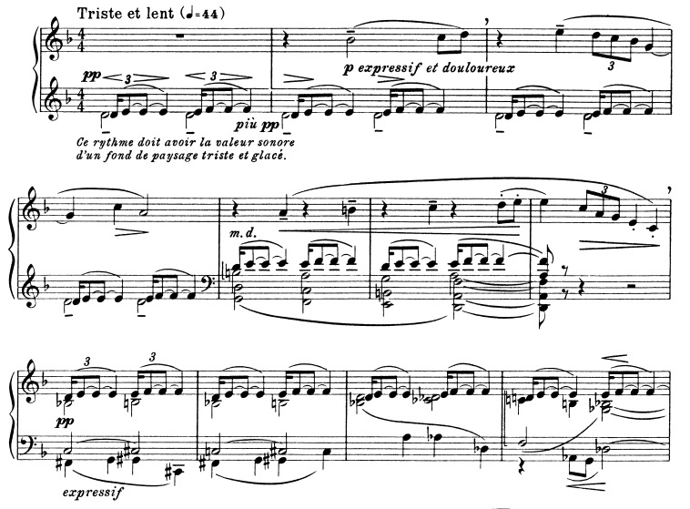
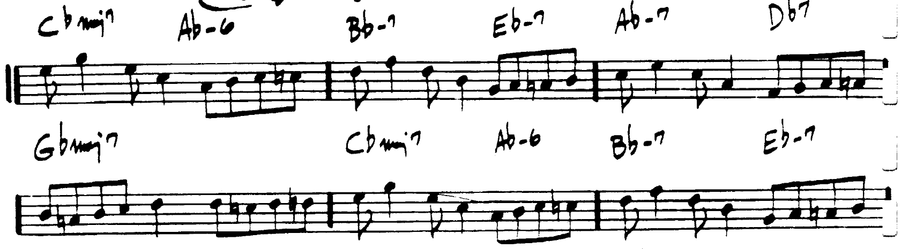

.. figure:: figures/Ceora.rb1.png 
          :scale: 80%

		  Figure 1: Lee Morgan's "Ceora"
             

		  Figure 2: The main theme of the movement (actually the main tune of the entire symphony). 

.. figure:: figures/wtc1.jpg
          
		  Figure 3: Is this a motive?

		  Figure 4: Debussy's "Des pas sur la neige", from the first book of *Preludes*

.. figure:: figures/bwv775.jpg

          Figure 5: Imitation of a motive in a Bach Invention
 
.. figure:: figures/grieg43no5.png
          :scale: 200 %

          Figure 6: Grieg's "Erotikon" from his *Lyric Pieces* is an obvious example of this, using grace notes.

.. figure:: figures/eroica.png
          :scale: 150 %

.. figure:: figures/eroicaReal.png
          :scale: 175 %

          Figure 7: The "hero" theme in the bass clef is transposed (by real transposition) in the bottom example.

          Figure 8: An example of tonal transposition in Mozart's *Symphony No.40*

          Figure 9: The "B" section of "Take Five" by Paul Desmond and Dave Brubeck.

.. figure:: figures/augdim.png
          :scale: 170 %

          Figure 10: Example of Augmentation and Diminution (Laitz, pg. 782) 

          Figure 11: Example of Retrograde usage in Haydn's Piano Sonata in A Major. 

Exercise
-----------------
Perform a motivic analysis on the following Brahms piece (the opening to "Mein wundes Herz", op.59, no.7)

.. figure:: figures/exercise1.pdf

          Exercise 1: Provide a motivic analysis of this Brahms excerpt.
Assignment
-----------------------------

For **Next Tuesday**: take two of the following melodies and elaborate them into a small 8-measure "piece." 
Avoid parallel fifths and octaves. You can write for SATB or Piano.

.. figure:: figures/hw1.png

.. figure:: figures/hw2.png

For **Next Thursday**: Perform a motivic analysis of the first movement (Adagio) of Mozart, Sonata no.4 in E-flat, K.282.
Simply identify the the primary themes, and transformations that they might undergo. Provide a 
photocopy of an annotated score, or a document with your own (Finale, Sibelius, etc.) 
demonstrations.