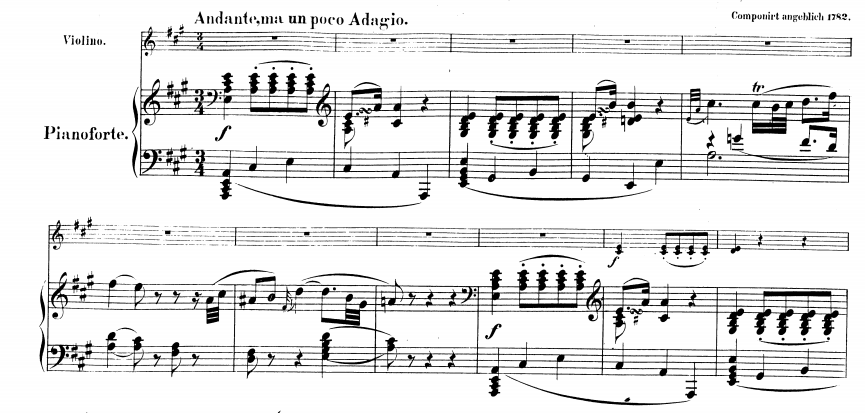

=================================================
Phrases and Cadences (Notes from Caplin, 1998)
=================================================

Today we are going to move away from the notions of motive and texture, and 
look at larger musical groupings, known as phrases and sentences.

This will begin our study of *Formenlehre*, which simply means the "teaching of form."

Sentences
===============

For our purposes, we will define a sentence as being an eight-measure structure. 
It typically begins with a two-measure **basic idea**, which will usually introduce the 
fundamental melodic (and motivic) material. There can be multiple motives in the basic 
theme. 

The sentences we will be looking at in the near future (those found in Haydn, Mozart, and 
Beethoven) contain phrases that indicate a presentation, a continuation, and a cadence.

Presentation Phrase
-----------------------

An eight measure sentence typically begins with a four-measure *presentation phrase*,
consisting of a repeated two measure **basic idea**, which can usually be heard as being
within a tonic area (see **tonic prolongation**).

Caplin writes that the "presentation functions to create a solid structural beginning
for the theme by establishing its melodic-motivic content in a stable harmonic-tonal
environment."(Caplin, 1998; p.35)

Basic Idea
~~~~~~~~~~~~~~~~~

A basic idea is basically what we've been exploring for the past couple of classes. 
It has a salient melodic aspect, is usually presented early on (in fact in the music
of Haydn, Mozart, and Brahms, it is almost always presented at the very beginning).

When looking at the repetition of the basic idea, it is helpful to think of three types
of repetition:

- Exact repetition (self-explanatory)
  
	- For example, this example from Mozart's K.330, i mm.1--8 shows an the statement of the basic idea in mm.1-2, and it's exact repetition in mm.3--4.

.. figure:: figures/ex3_5.png
          :scale: 200%

- Another example can be found in Haydn's Piano Sonata in B-flat, 41, ii 1--8:
	
.. figure:: figures/ex3_6.png
          :scale: 200%

- Statement-response repetition (a version of the basic idea in the tonic is followed by
  the same idea in the dominant).
  
	-See the Example  below, from Haydn's Piano Sonata in G, Hob, XVI:27, ii, 1--8. 

	.. figure:: figures/ex3_7.png
	          :scale: 200%
        
- Sequential Repetition occurs when the idea is **transposed to a different scale degree
  in both melody and harmony.**
  
	- See the example from Beethoven's piano Sonata in G, op.14/2 i 1--8. (Caplin, p.36)

.. figure:: figures/ex3_4.png
          :scale: 200%

Example 1
~~~~~~~~~~~~~~~~~~~~~

If we look at Example 1, from Beethoven's Piano Sonata 
in F minor, op.2/I, i mm.1--8, 
we can see that this 8-bar sentence can be divided 
into a number of nested ideas that we might
examine to understand what makes sentences work. 

.. figure:: figures/ex1_1.png
          :scale: 150%

First, we can see that we have a **basic idea** that spans the first two measures. This melodic
idea returns in m.3. We might call this the return of the basic idea, although now in it has
been transposed up a perfect fifth.

Because it has been repeated and we as listeners are now very conscious of it, 
we might think
of it as having been presented to us. We might therefore 
refer to the measures 1--4, with the basic idea and 
its repetition, as our *presentation phrase*.

Tonic Prolongation
~~~~~~~~~~~~~~~~~~~~~~~~~~

For Caplin (and many others) a presentation phrase prolongs the tonic harmony. The two 
concepts are intertwined.

An harmonic prolongation occurs when a single harmony (such as Tonic or Dominant) is 
perceived as existing for many measures, **despite the existence of interpolated harmonies**.

Prolongation creates *another level* of harmonic function. Therefore, there is both a 
local level (where there is an harmonic function for each chord), and a deeper level
in which there is a prolonged harmony.

The harmony of the first presentation of the basic idea is first presented with Tonic
accompaniment, while the repetition is over the dominant. The first instantiation of the
basic idea can be thought of as the "statement", whereas the second might be called the
"response."

Although we use the dominant harmony in mm.3--4, we might think of the entire first four 
measures as being able to be reduced to a tonic harmony. We might call this tonic
prolongation. Most "presentation" tend to be the result of a **tonic prolongation**.

Continuation Phrase
---------------------------

The *presentation phrase* can be followed in the next four measures 
by a *continuation phrase*. In the Classical Style, continuation phrases typically contain 
two characteristics:

- Harmonic Acceleration, in which the **harmonic rhythm** increases.
- Fragmentation, in which the size of the original motivic units are made smaller.

Looking at this example, we see that where we did have a harmonic change every two measures,
it now occurs every measure.

**The fragmentation occurs in the melody.** It helps that there's an exact repetition to 
help us delineate what exactly is the fragmented motive. It's the melody that occurs in m.2
of the piece. 

Because of this, we might now go back and distinguish between the motive 'a' in the first
measure, and motive 'b' in the second. It is motive 'b' that fragments in our continuation
phrase. 

Beethoven has completely detached motive 'B' from motive 'A', pretty much getting rid of 
the first part of the presentation phrase. In measure 7, he changes the 16th note triplets to
steady eighth notes, leading into the cadence.  The gradual dissolution of characteristic 
motives is frequently referred to as "liquidation."

Caplin writes that "...the purpose of motivic liquidation is to strip the basic idea of 
its characteristic features, thus leaving the merely conventional ones for the cadence."

This brings us to the third "formal function" 
(after presentation and continuation) is the *cadential* 
function. 

The cadential function usually consists of:

- Falling melodic line (or a melody which contains structural tones that descend)
- Harmonic cadence (HC, PAC, etc.) 

Cadential Phrase
------------------------

In the example above, the process of fragmentation, liquidation, harmonic acceleration, etc. 
all lead quite seamlessly into the cadential portion of the phrase. They allow the listener
to move away from the salient ideas from the first part of the sentence, and toward a point
of melodic and harmonic closure.

- Authentic cadential progressions 
	
	- "For the authentic cadential progression to posses sufficient harmonic strength to 
	confirm a tonality, both the dominant and the final tonic must be in root position, their most stable form." (Caplin, p.17)

- Half-cadential progressions
	
	- "In the half-cadential progression, the dominant itself becomes the goal harmony and so occupies the ultimate [final] position." (Caplin, p.19)

Exercise
----------------------

Provide an analysis of the basic idea, the phrases, the harmonic analysis, *etc.* 
for Mozart's Violin Sonata in A, K.402, mm.1--8:

Provide an analysis of the basic idea, the phrases, the harmonic analysis, *etc.* 
for Mozart's Piano Sonata in D, K.311, iii mm.1--8:

 
Periods
====================

The most common theme type in classical instrumental music is the 
eight-measure *period.* The period is divided into **two, four-measure phrases** 
fulfilling an **antecedent-consequent** relationship.

We can see a great example of this in the opening of the second movement of Mozart's *Eine kleine Nachtmusik*:

The Antecedent Phrase
-----------------------------

Again, we begin with a two-measure basic idea. 

**"In a sentence, the basic idea is immediately repeated, but in a period, the basic 
idea is juxtaposed with a contrasting idea, one that brings a week cadence"** (Caplin, 49)

Contrasting Idea
~~~~~~~~~~~~~~~~~~~~~~~

The contrasting idea introduces new motivic content. Contrast can be achieved by looking at a 
number of the elements that we've previously touched on this semester: texture, dynamics, and articulation.

As you can see from the example below, Haydn begins with a basic idea with an 
arpeggiated ascent in his Piano Trio in C (HV 27, iii, mm.1--8), 
but the scalar descent in the following measures, indicates that this is a contrasting idea. 
The consequent phrases continues this pattern of basic idea, followed by contrasting idea.

The most important contrast between the basic idea and the contrasting idea, however, is not melodic, but harmonic
content. Remember, **the basic idea is supported by a tonic prolongational progression, whereas the contrasting
idea should close with a cadential progression.**

Here, in Mozart's Piano Concerto in F, K.459, we have a basic idea presented in the first two measures,and a 
contrasting idea takes over at the end of m.2. We might think that it is not a contrasting idea, but some sort of repetition, 
but the harmonic context moves to a half cadence in m.4, whereas the basic idea doesn't. The consequent phrases follows this formula, as well.  

.. figure:: figures/ex4_4.png
           :scale: 150%

**"A basic idea followed by a contrasting idea does not in itself constitute an antecedent. Essential to 
this function is the presence of a weak cadence that effects partial closure of the phrase."** (Caplin, 51)

Most antecedent phrases will end with a half cadence; this allows for some sort of contrast when the consequent phrases ends with
more resolution, with a Perfect Authentic Cadence.

Exercise
--------------------

Write an eight-measure period using the given harmonic function and figured bass. Make sure to follow **all
part-writing rules.** This includes no parallels, the treatment of the leading tone, range, and spacing issues.

.. figure:: figures/antcons1.png
           :scale: 100 %
