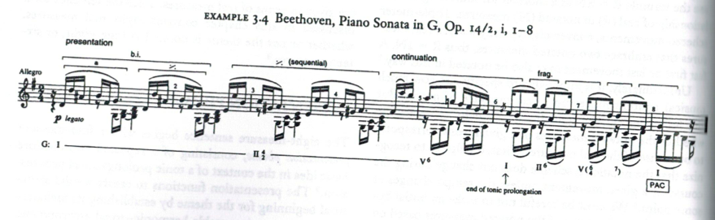
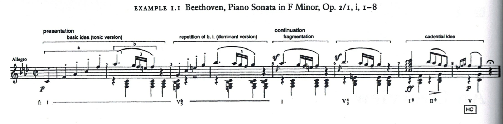
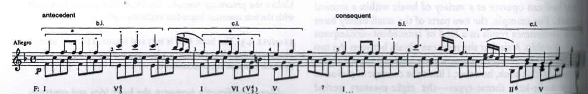

=========================================================
Phrases and Cadences (Caplin's Formal Functions; 1998)
=========================================================

Sentences
===============

Basic Idea and Presentation Phrase
-------------------------------------

When looking at the repetition of the basic idea, it is helpful to think of three types
of repetition:

- Exact repetition (self-explanatory)
  
	- For example, this example from Mozart's K.330, i mm.1–8 shows an the statement of the basic idea in mm.1-2, and it's exact repetition in mm.3--4.

.. figure:: figures/ex3_5.png
          :scale: 200%

- Another example can be found in Haydn's Piano Sonata in B-flat, 41, ii 1–8:
	
.. figure:: figures/ex3_6.png
          :scale: 200%

- Statement-response repetition (a version of the basic idea in the tonic is followed by
  the same idea in the dominant). See the Beethoven example below (Example 1.1)
        
- Sequential Repetition occurs when the idea is **transposed to a different scale degree
  in both melody and harmony.**
  
	- See the example from Beethoven's piano Sonata in G, op.14/2 i 1–8. (Caplin, p.36)

Example 1
~~~~~~~~~~~~~~~~~~~~~

Beethoven's Piano Sonata 
in F minor, op.2/I, i mm.1–8:

Continuation Phrase
---------------------------

The *presentation phrase* can be followed in the next four measures 
by a *continuation phrase*. In the Classical Style, continuation phrases typically contain 
two characteristics:

- Harmonic Acceleration, in which the **harmonic rhythm** increases.
- Fragmentation, in which the size of the original motivic units are made smaller.

**The fragmentation occurs in the melody.** It helps that there's an exact repetition to 
help us delineate what exactly is the fragmented motive. It's the melody that occurs in m.2
of the piece. 
The gradual dissolution of characteristic 
motives is frequently referred to as "liquidation."

Caplin writes that "...the purpose of motivic liquidation is to strip the basic idea of 
its characteristic features, thus leaving the merely conventional ones for the cadence."

This brings us to the third "formal function" 
(after presentation and continuation) is the *cadential* 
function. 

The cadential function usually consists of:

- Falling melodic line (or a melody which contains structural tones that descend)
- Harmonic cadence (HC, PAC, etc.) 

Cadential Phrase
------------------------

- Authentic cadential progressions 
	
	- "For the authentic cadential progression to posses sufficient harmonic strength to 
	confirm a tonality, both the dominant and the final tonic must be in root position, their most stable form." (Caplin, p.17)

- Half-cadential progressions
	
	- "In the half-cadential progression, the dominant itself becomes the goal harmony and so occupies the ultimate [final] position." (Caplin, p.19)

Exercise
----------------------

Provide an analysis of the basic idea, the phrases, the harmonic analysis, *etc.* 
for Mozart's Violin Sonata in A, K.402, mm.1–8:

.. figure:: figures/mozartk402.png
          :scale: 250%

Provide an analysis of the basic idea, the phrases, the harmonic analysis, *etc.* 
for Mozart's Piano Sonata in D, K.311, iii mm.1–8:

.. figure:: figures/mozartk311rondo.png
           :scale: 250%
 
Periods
====================

The most common theme type in classical instrumental music is the 
eight-measure *period.* The period is divided into **two, four-measure phrases** 
fulfilling an **antecedent-consequent** relationship.

We can see a great example of this in the opening of the second movement of Mozart's *Eine kleine Nachtmusik*:

.. figure:: figures/ex1_3.png
           :scale: 150%
The Antecedent Phrase
-----------------------------

Again, we begin with a two-measure basic idea. 

**"In a sentence, the basic idea is immediately repeated, but in a period, the basic 
idea is juxtaposed with a contrasting idea, one that brings a week cadence"** (Caplin, 49)

Contrasting Idea
~~~~~~~~~~~~~~~~~~~~~~~

As you can see from the example below, Haydn begins with a basic idea with an 
arpeggiated ascent in his Piano Trio in C (HV 27, iii, mm.1–8), 
but the scalar descent in the following measures, indicates that this is a contrasting idea. 
The consequent phrases continues this pattern of basic idea, followed by contrasting idea.

.. figure:: figures/ex4_1.png
           :scale: 150%

Here, in Mozart's Piano Concerto in F, K.459, we have a basic idea presented in the first two measures,and a 
contrasting idea takes over at the end of m.2. We might think that it is not a contrasting idea, but some sort of repetition, 
but the harmonic context moves to a half cadence in m.4, whereas the basic idea doesn't. The consequent phrases follows this formula, as well.  

**"A basic idea followed by a contrasting idea does not in itself constitute an antecedent. Essential to 
this function is the presence of a weak cadence that effects partial closure of the phrase."** (Caplin, 51)

Exercise
--------------------

Write an eight-measure period using the given harmonic function and figured bass. Make sure to follow **all
part-writing rules.** This includes no parallels, the treatment of the leading tone, range, and spacing issues.

.. figure:: figures/antcons1.png
           :scale: 100 %
