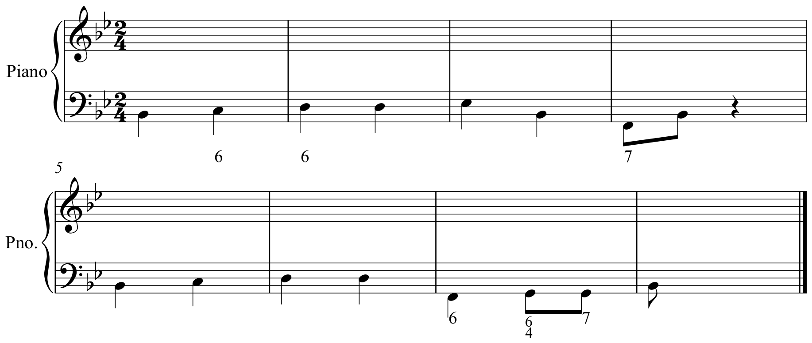

Review on Phrases and Cadences
===================================

**"In a sentence, the basic idea is immediately repeated, but in a period, the basic 
idea is juxtaposed with a contrasting idea, one that brings a week cadence"** (Caplin, 49)

**"A basic idea followed by a contrasting idea does not in itself constitute an antecedent. Essential to 
this function is the presence of a weak cadence that effects partial closure of the phrase."** (Caplin, 51)

Exercise 1
--------------------

Write an eight-measure period using the given harmonic function and figured bass. Make sure to follow **all
part-writing rules.** This includes no parallels, the treatment of the leading tone, range, and spacing issues.

This should have a basic idea, a contrasting idea, and an antecedent-consequent phrase.

Exercise 2
---------------------

.. figure:: figures/antcons1.png
           :scale: 100 %

